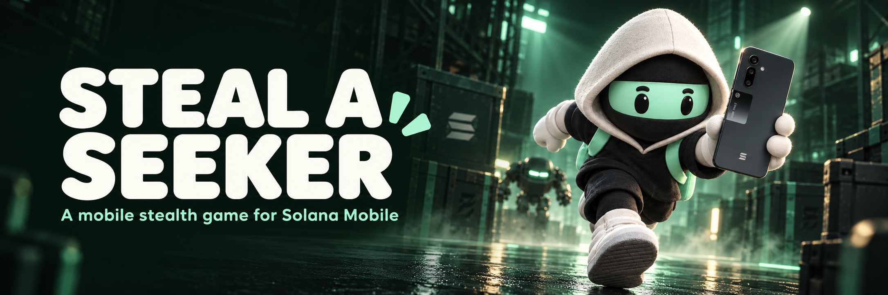

# Steal a Seeker

**Sneak past guards, grab a Seeker phone, and escape.** A free Android stealth game built for Solana Mobile and available on the Solana dApp Store. Tap the floor to move, tap a guard to attack, and use walls to stay out of sight.

[Website](https://stealaseeker.bluntbrain.com/) · [Gameplay](https://x.com/bluntbrain/status/2102319437173191157) · [Jev livestream](https://x.com/i/broadcasts/1XxygweZEYnGM) · [Updates](https://x.com/StealASeeker)

## The game

Play through **1,000 missions**, with laser alarms, changing patrols, hiding places, and seven bosses inspired by the Solana community. Replay missions to improve your score. Search a friend's **Seeker ID (.skr)** and compare your verified scores side by side.

Hunter Assassin inspired the short stealth missions. Candy Crush inspired the scrolling map and the simple question behind the friend feature: **“Which level are you on?”**

## Built for mobile and Solana

- **Native touch gameplay:** React Native and Skia render the game, with tap-to-move paths, animated characters, sound, and haptics.
- **Play before connecting:** Start without a wallet. The first 100 levels are bundled; later levels are downloaded and cached. Saved progress and queued runs sync when connected.
- **Wallet identity:** Mobile Wallet Adapter connects Android wallets. Wallet-to-`.skr` lookup displays readable leaderboard names; Seeker ID search lets you pick a friend to compare with.
- **Optional SKR / SOL purchases:** Buy outfits and credit packs, or a Game Pass bundle. The campaign stays free, and outfits have equal gameplay stats. In-game credits are not withdrawable tokens.
- **Verified results:** The backend replays submitted inputs before granting ranked scores and credits. Finalized payment checks and a transaction ledger prevent duplicate purchase grants.

## How it works

| Area | Implementation |
| --- | --- |
| App | TypeScript, React Native 0.83, Expo 55, Skia; [game](src/game), [screens](src/components), [wallet](src/wallet) |
| Campaign | 12 authored opening missions, then seeded maze layouts and boss arenas; [generator](shared/campaign-levels.ts), [download/cache/sync](src/campaign/client.ts) |
| Backend | Node.js, Fastify, PostgreSQL on Railway; [run verification](server/replay.ts), [campaign service](server/campaign-service.ts), [.skr lookup](server/wallet-names.ts) |

## Run locally

Use Node.js 22+. Android builds also need Java 17 and Android SDK 36.

```sh
npm ci
npm run android       # Native development build; required for wallet testing
# Or: npm run web     # Browser preview
npm run typecheck
npm test
```

See [Android release setup](docs/RELEASE.md) for signing and APK builds. Wallet connections require a native build, not Expo Go.

Built by [Ishan Lakhwani (@bluntbrain)](https://x.com/bluntbrain) for CLOCK IN. I also connected Jev AI to play the campaign on a livestream; its runs are excluded from the human leaderboard.
