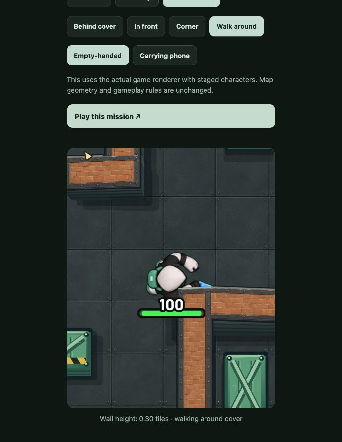
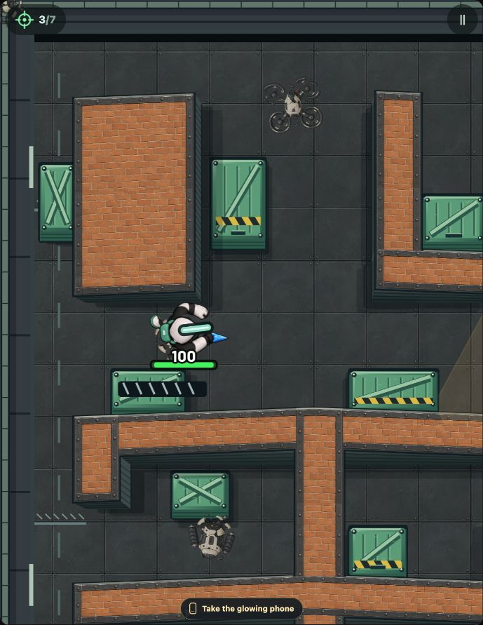

# Courier animation verification — code 60

Version: 1.1.3. Source commit: `81f8916`. Package: `com.bluntbrain.stealaseeker`.

APK SHA-256: `6141b0b8e3285ce54f8f26267604b1bcf993389b3a34aff84d40ff61820c4e0b`.

## Passed

- TypeScript typecheck.
- Seven focused tests for old costume compatibility, actual-travel gating, the 1.6-second gait, carrying transitions, attack priority, and identical central hood pixels across all 72 frames. Arm pixels change between walk poses.
- Rules manifest check: gameplay simulation and weekly engine unchanged.
- Web production export and interactive checks in the actual Skia renderer: walking around cover, idle in front of cover, empty-handed and carrying states. One phone is visible in carrying poses.
- Live browser mission interaction: tap-to-move and a knife encounter; the HUD advanced to 2/7 defeated guards. This was a smoke check, not a completed mission or campaign regression test.
- Signed mainnet ARM64 APK build. Existing signing certificate SHA-256: `4fa3e9942238f110824fb67dc99438fc1d70ef48a273e4a79331d5f8a1e1e913`.
- Byte-for-byte match between the new local atlas and the atlas inside the APK. See [artifact check](artifact-check.json).
- Upgrade install on `emulator-5554`, AVD `StealSeeker_Code27_QA`; installed version confirmed as 1.1.3/code 60. Cold launch returned `Status: ok` in 1083 ms. The process remained running. No matching fatal exception, app ANR, or React Native error appeared in the sampled startup log.

## Limits

The emulator window was unavailable through the UI-control tool. Emulator evidence covers installation and startup only; interactive gameplay evidence is from the browser. No physical Seeker performance, tactile, wallet, purchase, or full campaign test was performed. Boundary-wall concept changes from the separate design proposal are not part of this change.

## Browser evidence

